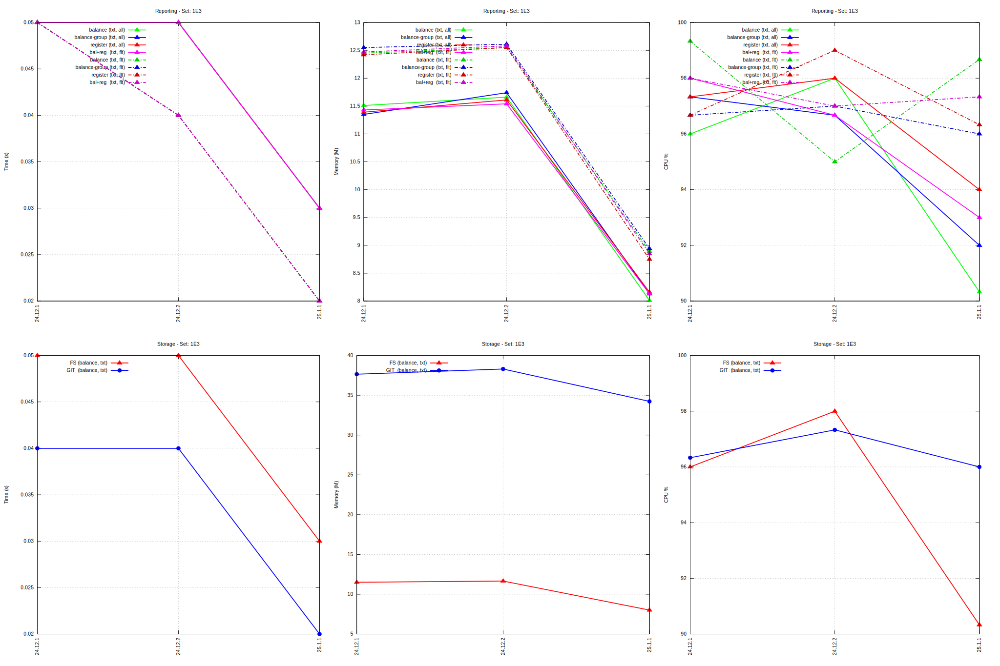
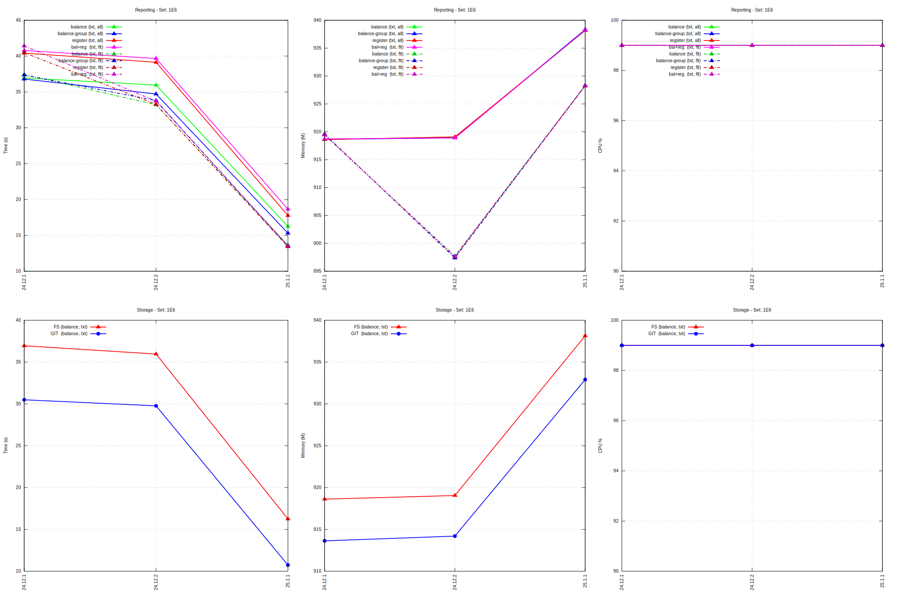

= HW02 (laptop) performance results

----
cpu: Intel(R) Core(TM) i5-8250U CPU @ 1.60GHz
hd:  WD Red SN700
mem: 32GB
----
Raw test results: link:./hw02/[HW02 (laptop)]

== perf-1E3

link:./perf-hw02-1E3.svg[Graph: HW02 1E3]

== perf-1E6

link:./perf-hw02-1E6.svg[Graph: HW02 1E6]

'''
Tackler is distributed on an *"AS IS" BASIS, WITHOUT WARRANTIES OR CONDITIONS OF ANY KIND*, either express or implied.
See the link:../../LICENSE[License] for the specific language governing permissions and limitations under
the link:../../LICENSE[License].
